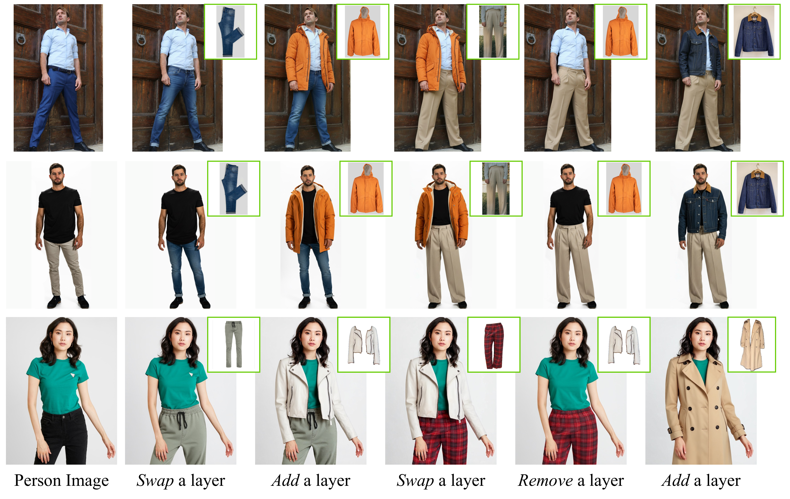

# Layering Virtual Try-On

**Authors**: [Chun Feng](https://github.com/ChuenFung), [Bowei Chen](https://armastuschen.github.io/), [Mengyi Shan](https://shanmy.github.io/), and [Ira Kemelmacher-Shlizerman](https://www.irakemelmacher.com/)

[](https://arxiv.org/pdf/2607.22924)
[](https://chunfeng-projects.github.io/layering-virtual-tryon/)



---

> **Running this on Google Colab?** Use [`Layering_VTON_Colab.ipynb`](./Layering_VTON_Colab.ipynb)
> and read [`COLAB_README.md`](./COLAB_README.md) first. The base model is 57.7 GB
> in bf16 and does not fit on any Colab GPU; the notebook uses a 4-bit build
> (~17 GB) and patches several bugs in the demo code that break on non-A100
> hardware. The instructions below are the original, unmodified upstream setup.

---

## Getting Started

This directory contains the official web demo for Layering Virtual Try-On, which allows users to perform try-ons with **add** (layering) and **swap** modes.

### 1. Environment Setup

We provide an `environment.yml` file to quickly set up the required Conda environment. Note that our codebase relies on a customized version of `diffusers` (v0.36.0.dev0) which is included in this repository.

First, create and activate the conda environment:
```bash
conda env create -f environment.yml
conda activate layering_demo
```

Next, because YOLO pose extraction (`easy-dwpose`) has specific dependency constraints, we install it separately:
```bash
pip install easy-dwpose==1.0.2 --no-deps
```

### 2. Download Checkpoints

Because the pose extraction models exceed GitHub's 100MB file limit, they are not included in this repository. You need to manually download them and place them in the `checkpoints/` directory.

1. Download `yolox_l.onnx` and `dw-ll_ucoco_384.onnx` (e.g., from [HuggingFace DWPose](https://huggingface.co/yzd-v/DWPose/tree/main)).
2. Create a `checkpoints` folder inside this demo directory and place the `.onnx` files inside it.

```bash
mkdir checkpoints
# Place yolox_l.onnx and dw-ll_ucoco_384.onnx inside the checkpoints/ directory
```

### 3. Run the Demo

Simply run the `app.py` script to launch the Gradio web interface. The app will automatically initialize the pipeline and load the model weights from the `weights` directory.

```bash
python app.py
```

Then, open your web browser and navigate to the local URL provided in the terminal (usually `http://127.0.0.1:7860`).

### 3. Usage Guide

1. **Person Image**: Upload a full-body image of a person.
2. **Garment Image**: Upload an image of the garment you wish to try on.
3. **Mode**: Choose either `swap` (traditional try-on) or `add` (layering).
4. **Description**: Describe the edit (e.g., "swap the beige leggings for dark wash jeans" or "add a light gray turtleneck sweater").
5. **Pose (Optional)**: If left blank, the app will automatically extract the pose from the uploaded person image using DWpose. You can also upload a custom pose image if desired.
6. Click **Run VTON** to execute. The interface will first update to show you the processed inputs (padded to 512x896), and then display the final generation result once inference completes.
